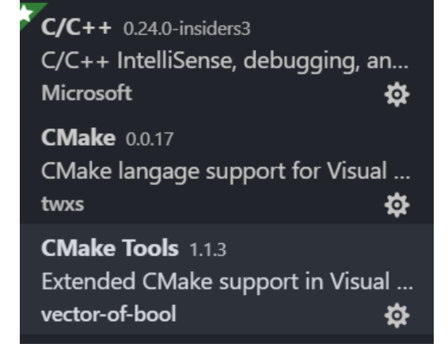

# 使用VScode CMake搭建TDD工程示例

## 必要工具:
- VSCode
- CMake
- CMake Tools

其插件如图所示:



## 示例工程

1. 新建一个目录 比如 gtestExample
2. 在gtestExample目录下,下载[googletest](https://github.com/google/googletest) ;
3. (对于某些没有完全支持c++11的编译环境 只能使用[1.8.1版本](https://github.com/google/googletest/releases/tag/release-1.8.1)
4. 在gtestExample根目录下新建CMake编译文件CMakeLists.txt

```cmake

cmake_minimum_required(VERSION 3.8)
set(This Example)
project(${This} C CXX)
set(CMAKE_C_STANDARD 99)
set(CMAKE_CXX_STANDARD 11)
set(CMAKE_POSITION_INDEPENDENT_CODE on)
//use 1.8.1 here when I use VS2015 compiler
add_subdirectory(googletest-release-1.8.1)
set(
Headers
Example.hpp
)
set(
Sources
Example.cpp
)
# force static runtime libraries for msvc builds
if(MSVC)
set(variables
CMAKE_CXX_FLAGS_DEBUG
CMAKE_CXX_FLAGS_RELEASE
  CMAKE_CXX_FLAGS_RELWITHDEBINFO
  CMAKE_CXX_FLAGS_MINSIZEREL
)
foreach(variable ${variables})
  if(${variable} MATCHES "/MD")
   string(REGEX REPLACE "/MD" "/MT" ${variable} "${${variable}}")
  endif()
endforeach()
endif()
add_library(${This} STATIC ${Sources} ${Headers})
add_subdirectory(test)
enable_testing()


```
我们需要的文件 有Example.cpp 以及 Example.hpp 二者是我们根目录文件,是我们需要TDD开发的产品代码

### 测试文件
接着我们新建一个test目录,这里是我们的测试目录;

在test目录下,我们继续写一个CMakeLists.txt,

```cmake

cmake_minimum_required(VERSION 3.8)
set(This ExampleTests)
set(SOURCES
ExampleTest.cpp)
add_executable(${This} ${SOURCES})
target_link_libraries(${This} PUBLIC
gtest_main
Example)
add_test(
NAME ${This}
COMMAND ${This}
)


```

接着 ,在test目录下新建一个ExampleTest.cpp文件,这里是我们的google test代码;


### 开始构建吧

使用cmake 最大的好处就在这里,不需要弄那么多麻烦的配置,一个脚本就可以了,

现在的工程目录结构如图:


在gtestExample根目录,开始构建cmake工程


使用VScode的cmake 工具时,第一步会需要指定 构建工具:


这里我的选择 挺多的,构建完成只是时间问题;
如果你构建失败,可以从cmake脚本和运行库,google test的版本中查找原因;

构建完成后,按 F1键 :


### 写测试的测试代码
```c++

#include <gtest/gtest.h>

TEST(ExampleTests, DemonstaateGTestMacors)
{
    EXPECT_TRUE(false);
// ASSERT_TRUE(false);
// EXPECT_TRUE(false);
// EXPECT_TRUE(false);
}


```
选择 Cmake run tests
则开始 运行测试了;
运行结果 如下:


### TDD
是的,目前为止,我们 还一行代码没有敲呢.
但是 整个开发的工程已经就位了;
### 先写测试用例
在`test\ExampleTest.cpp`中 书写测试代码

```c++
#include <gtest/gtest.h>
#include "../Example.hpp"
TEST(ExampleTests, DemonstaateGTestMacors)
{
int a = 1;
int b = 2;
EXPECT_EQ(max(a, b), 2);
}

```

测试代码里严明,我们需要实现一个`max`函数,其返回两个int型数据较大的数;
执行测试,测试用例失败;

### 产品代码
接着,我们要让写让测试通过的代码;

我们在`Example.hpp`中 声明待测试的函数max
```c++

int max(int a, int b);

```

在`Example.cpp`中实现它:

```c++

#include "Example.hpp"
int max(int a, int b)
{
return a > b ? a : b;
}


```

继续测试,测试通过;


如此,一个完整的 TDD 工程就搭建完整了,后面,就可以进行真实的代码开发了;


