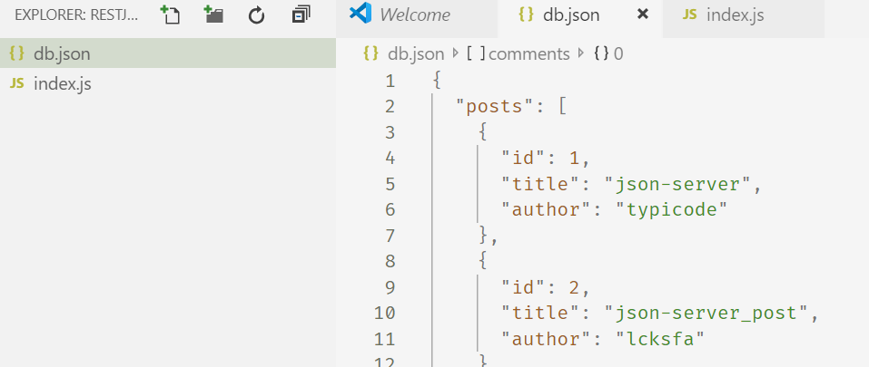
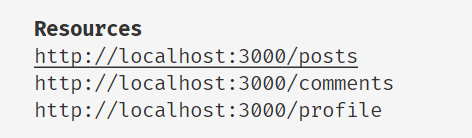
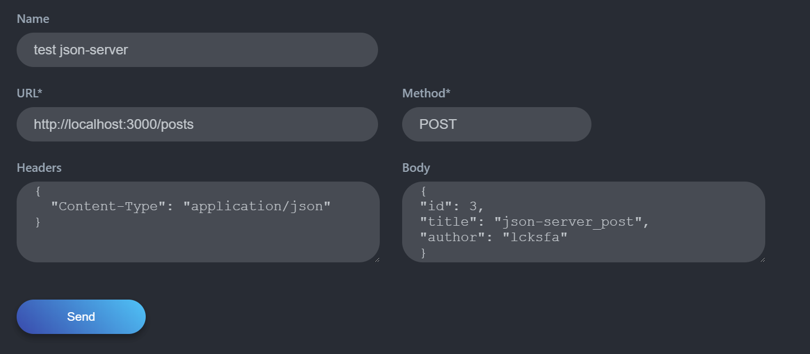

# 今日工具 fakeit 以及json-server

## fakeit

[fakeit](https://github.com/eranpeer/FakeIt/wiki/Quickstart)

这是一个mock测试工具;用于tdd测试中再好不过,非常简单易用;

## json-server

[json-server](https://github.com/typicode/json-server)

npm install -g json-server   

安装后,在目录下新建db.json

也可以使用js代码,启动命令相应改变

`json-server --watch db.json`

或者

` json-server --watch index.js`

默认的端口为3000:` http://localhost:3000`

使用浏览器可以打开具体的json返回:

不过，还可以使用vscode 的插件来调用:

插件名称为simple rest client;

我这里是使用的post指令,可以向db.json中插入一条json数据;继续插入时id不能重复;

