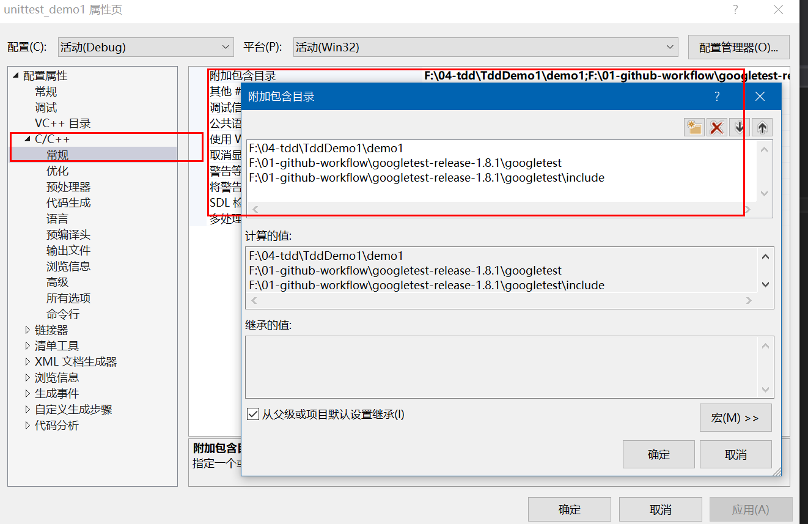
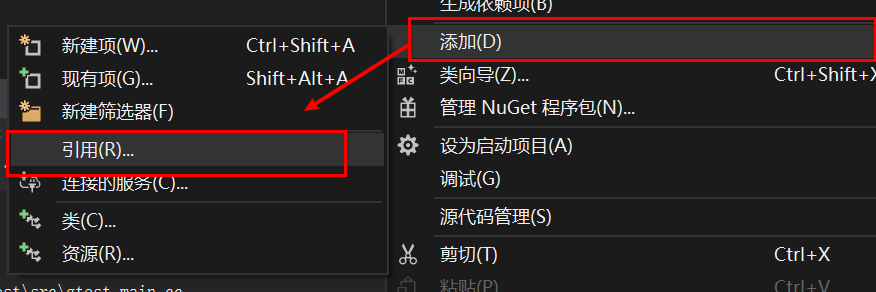
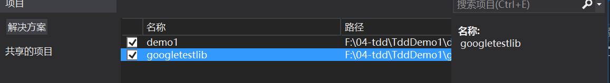

# 在VS2015中使用googletest进行TDD

## 安装googletest

[github源码](https://github.com/google/googletest)

`git clone https://github.com/google/googletest`

编译出错：

VS2015 无法支持完整的C++11语法，所以目前只能使用[1.8.1版本](https://codeload.github.com/google/googletest/zip/release-1.8.1)的Googletest了。

## 编译gt库

1. 新建一个静态的，无预编译头的win32工程
2. 配置gtest的目录：

3. 在工程源文件中添加gtest的src里的gtest_main.cc和gtest-all.cc文件：

4. 编译生成即可：

## test工程

1. 

这里的工程不能为空，生成后把stdafx相关的删除。

配置附加路径：

添加引用：

主工程在也需要编译为静态库，，不过这不是必须的，我们的目的是测试产品代码的类和逻辑函数；

