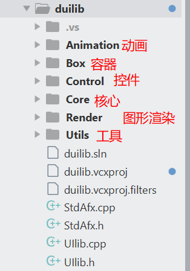

# 网易UI库总览

网易开源了基于Duilib的UI库以及其配套的开发工具,[github地址](https://github.com/netease-im/NIM_Duilib_Framework/)

网易称这是一个完整的开发框架,使用它可以开发任何的桌面程序.
该框架的windows UI库是基于Duilib 二次开发的,不过改动极大,想必是花了不少功夫的.
这个UI库,下面使用NIMUI指代,以区别于传统的duilib.
源码中有相对完善的doc,以及开发示例,大体介绍了UI控件,布局,浏览器开发的使用.

其代码布局为:

├─`bin` 各个示例程序输出目录，包含预设的皮肤和语言文件以及 CEF 依赖  
├─`docs` duilib 接口的说明文档  
├─`libs` 静态库编译后的输出目录，包含预设的一些 CEF 组件静态库  
├─`samples` 各类示例程序  
├─`third_party` 第三方库，目前仅有 cef_control 有依赖  
├─`toolkits`       
│  ├─`base` 基础类库  
│  ├─`duilib` duilib 核心代码，依赖 base 但不依赖 shared  
│  ├─`shared` 包含一些工具的封装，如命令行解析、日志、路径处理等  
│  ├─`ui_components` 基于 duilib 封装的常用组件库如 `msgbox`、`toast`、`cef_control` 等  

这个框架需要使用c++11,使用的编译器 最好在VS2013以上.


## 先主要是分析UI库.
代码组成:


我们知道,duilib基本满足了UI和逻辑分离的要求的,其UI的创建是渲染的xml文件,因此,窗口的生成可以直接通过写xml文件的方式来进行.
那么`,duilib是如何找到xml,又是如何把xml转变成windows窗口的呢?`
带着这个问题,我们来看看网易的源码.
首先,我们从sample中的basic例子看起,看源码,总想先找到一个起点,而例子中的basic是一个最简单的例子;

程序的入口 为wWinMain,里面只有两句话是新写的
```c++
 MainThread thread;
// 执行主线程循环
thread.RunOnCurrentThreadWithLoop(nbase::MessageLoop::kUIMessageLoop);
```
也就是说,当程序运行到入口后,我们需要新建一个UI线程,这个线程开始loop.
沿着MainThread继续看MainThread的实现,它继承于 nbase::FrameworkThread,构造时即调用FrameworkThread的构造函数,并重写了FrameworkThread的Init 和 Cleanup函数,

下面就使用RunOnCurrentThreadWithLoop  ----> Run()开始消息循环,Run函数做了实际的工作
源码

```c++
void FrameworkThread::Run()
{
#ifndef NDEBUG
#if defined(OS_WIN) && defined(COMPILER_MSVC)
//VS的调试模式下,设置线程名,用于定位问题
	SetThreadName(GetCurrentThreadId(), name_.c_str());
#endif
#endif
    // Initilize the tls data, must be called before any tls associated calls on current thread
	InitTlsData(this);
	SetThreadWasQuitProperly(false);
	{
		ThreadId thread_id = Thread::CurrentId();
		set_thread_id(thread_id);

		// The message loop for this thread.
		MessageLoop *message_loop;
		if (loop_type_ == MessageLoop::kCustomMessageLoop)
			message_loop = factory_->CreateMessageLoop();
		else {
			if (loop_type_ == MessageLoop::kIOMessageLoop)
				message_loop = new IOMessageLoop;
#if defined(OS_WIN)
			else if (loop_type_ == MessageLoop::kUIMessageLoop)
				message_loop = new UIMessageLoop;
#endif
			else
				message_loop = new MessageLoop;
		}
		message_loop_ = message_loop;

		// Let the thread do extra initialization.
		// Let's do this before signaling we are started.
		Init();

		event_.Signal();

#if defined(OS_WIN)
		message_loop_->RunWithDispatcher(dispatcher_);
#else
		message_loop_->Run();
#endif // OS_WIN

		// Let the thread do extra cleanup.
		Cleanup();

		//DCHECK(GetThreadWasQuitProperly());

		// We can't receive messages anymore.
		if (loop_type_ != MessageLoop::kCustomMessageLoop)
			delete message_loop_;
		else
		{
			delete message_loop_;
			factory_.reset();
		}
		message_loop_ = NULL;
	}
	set_thread_id(kInvalidThreadId);
	{
		FrameworkThreadTlsData *tls = GetTlsData();
		if (tls != NULL)
		{ }
			//DCHECK(tls->managed == 0); // you must call ThreadManager::UnregisterThread before come there
	}
	FreeTlsData();
}
```
可见 Run的主要流程是 :
---->设置tls数据,
---->根据指定的loop类型创建message,
---->调用Init,发送event信号,开始启动,调用RunWithDispatcher循环开启,

循环结束则调用Cleanup清理资源.释放message tls等,

那么回到MainThread,我们复写的Init则是自定义了loop开始前的初始化,而与之对应的就是Cleanup释放资源.

看看这里的MainThread的Init做了什么

```C++
void MainThread::Init()
{
	nbase::ThreadManager::RegisterThread(kThreadUI);

	// 获取资源路径，初始化全局参数
	std::wstring theme_dir = QPath::GetAppPath();
#ifdef _DEBUG
	// Debug 模式下使用本地文件夹作为资源
	// 默认皮肤使用 resources\\themes\\default
	// 默认语言使用 resources\\lang\\zh_CN
	// 如需修改请指定 Startup 最后两个参数
	ui::GlobalManager::Startup(theme_dir + L"resources\\", ui::CreateControlCallback(), false);
#else
	// Release 模式下使用资源中的压缩包作为资源
	// 资源被导入到资源列表分类为 THEME，资源名称为 IDR_THEME
	// 如果资源使用的是本地的 zip 文件而非资源中的 zip 压缩包
	// 可以使用 OpenResZip 另一个重载函数打开本地的资源压缩包
	ui::GlobalManager::OpenResZip(MAKEINTRESOURCE(IDR_THEME), L"THEME", "");
	// ui::GlobalManager::OpenResZip(L"resources.zip", "");
	ui::GlobalManager::Startup(L"resources\\", ui::CreateControlCallback(), false);
#endif

	// 创建一个默认带有阴影的居中窗口
	BasicForm* window = new BasicForm();
	window->Create(NULL, BasicForm::kClassName.c_str(), WS_OVERLAPPEDWINDOW & ~WS_MAXIMIZEBOX, 0);
	window->CenterWindow();
	window->ShowWindow();
}
```

- 第一步,注册UI线程到线程管理器中,
- 第二步 资源获取,;
- 第三步,创建窗口并显示到中间.
- 
和传统Duilib不同的是,NUMUI没有在创建窗口时开始消息循环,这个循环是在线程管理器中进行的.也不同于经典的::GetMessage(&msg, NULL, 0, 0) ,::DispatchMessage(&msg) .

与init之对应的就是Cleanup函数,主要完成资源的释放,线程的反注册等.