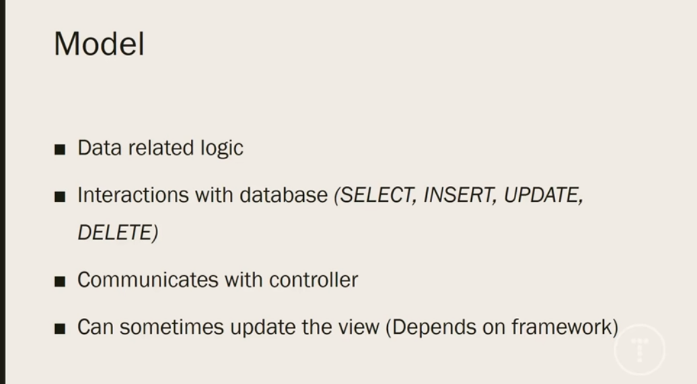
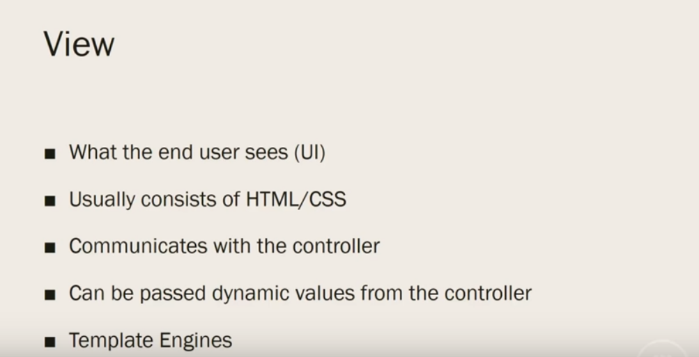
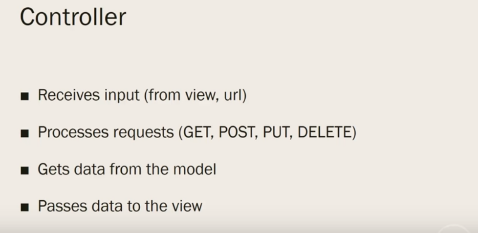
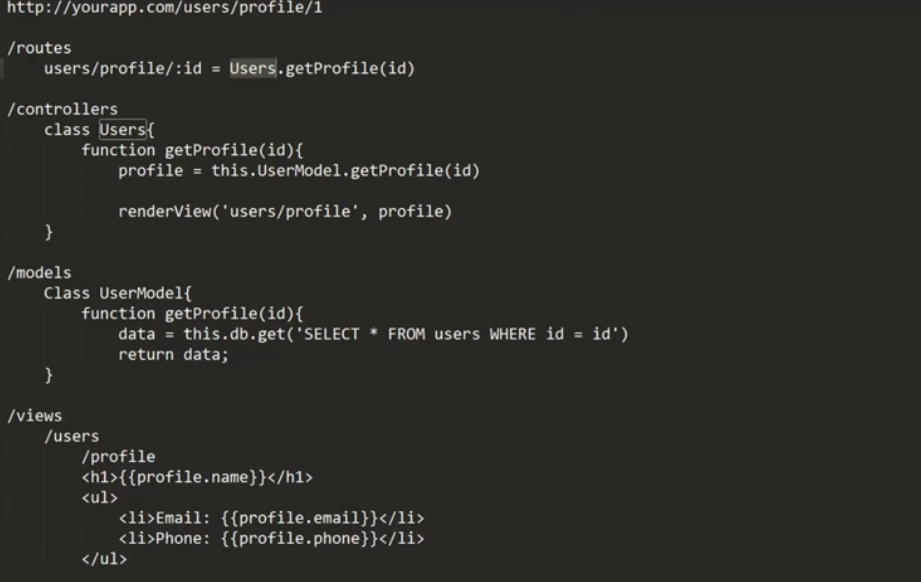

# Web开发：浏览器、小程序和PWA

canvas 自绘窗体

因为工作的原因，莫名其妙的成为了大前端的一员，从Windows原生直绘界面到基于Qt的Web混合开发，再到Flutter移动跨平台，一路走来是越来越惊讶，前端的知识体系气泡越吹越大，突发学海无涯之感。不过我也一直在思考那么不变的东西，从框架的架构角度理解，它们其实是借鉴和传承的，因此不论是使用C++还是JS或者Dart，貌似都不再是难题了。学习架构课不一定就是奔着学完做架构师去的，也是为了更好的把自己的知识体系串通组建起来，没必要在开发语言的细节泥潭里无法自拔

Because of the work, it has become a part of the big front end. From Windows native direct drawing interface to Qt-based Web hybrid development, to Flutter mobile cross-platform, it is more and more surprised along the way, the front-end knowledge system bubble The more you blow, the more you feel .However, I have been thinking about things that are not constant. From the architectural perspective of the framework, they are actually borrowed and passed on. Therefore, whether using C++ or JS or Dart, it seems to be no longer a problem. Learning architecture classes are not necessarily the ones who go to learn to be architects, but also to better build up their knowledge systems. There is no need to be able to extricate themselves in the details of the development language.

## 理解下MVC

