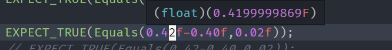

# C++ Templates入门一

> be As a C++ enthusiast

模板是C ++的强大功能，允许您编写通用程序。 简单来说，您可以使用模板创建单个函数或类来处理不同的数据类型。 模板通常用于较大的代码库中，以实现代码的可重用性和程序的灵活性。

C++的模板一直是我一块没有攻取的高山，今天学习了一些视频，做些基础入门；

我使用了gtest一起学习templates。

## 函数模板

一个很基础的例子，比较两个值是否相等的函数；

不过，在使用前，我们并不知道用于会用于那些类型的数据的大小比较，所以，我们需要把这个函数写成函数模板；

这算是使用模板函数最直接的理由；

其通用函数原型定义如下：

```c++
template <typename T>
bool Equals(const T& lhs,const T& rhs){
	return lhs == rhs;
}
```

我们使用gtest来测试这个函数：

```c++
TEST(Template1Test, TestEquals)
{
    EXPECT_TRUE(Equals(1,1));
    EXPECT_TRUE(Equals(std::string("1"),std::string("1")));
    EXPECT_TRUE(Equals(2.0,2.0));
}
```

运行发现，全部pass，恩，开了个好头。

### 模板特化

新增一个测试

```c++
EXPECT_TRUE(Equals(0.42f-0.40f,0.02f));
```

发现测试失败了。

这是什么原因呢？

因为我使用了f标识每个参数，这表明使用的类型为float，而我们知道，浮点数在使用加减计算时是不准确的。在VSCode下的提示如下：



一个`0.42f`在我的机器上的真实数值并不是0.42 而是`0.41999999869.`如此`0.42f-0.40f`的值当然和`0.02f`不等了，于是测试失败了；

 也就是说为了使用`template Equals`模板函数，使其在浮点数计算时也能正确返回，我们必须将浮点数参数特化下：

#### 特化方案一

```c++
template < >
bool Equals<float>(const float& lhs,const float& rhs)
{
    std::cout << "Use Equals<float> in template!" << std::endl;
    return abs(lhs - rhs) < 0.0000001;
}

```

测试用例通过！

然而，我们继续新增一个测试；

```c++
EXPECT_TRUE(Equals(0.42-0.40,0.02));
```

测试又失败了！

这个的原因是，C+中的浮点数类型 默认是double类型的，而我们只特化了float，所以在使用这个测试时调用的仍然是通用的Equals模板函数，又回到了浮点数计算不精确的问题上，于是，我们需要把double类型也特化一下：

```c++
template < >
bool Equals<double>(const double& lhs,const double& rhs)
{
    std::cout << "Use Equals<double> in template!" << std::endl;
    return abs(lhs - rhs) < 0.0000001;
}
```

继续测试，通过用例。


#### 特化方案二

一个通用的模块，另外还有如此多的特化模板，我还不如写函数重载呢？所以 ，有没有更好的模板函数的code方法呢？答案是有的！

先上代码，函数模板完全改下如下：

```c++
#include <type_traits>
// tag dispatch 
// SFINAE -> substitution failure is not an error!
// std::enable_if_t is in c++14 
template <typename T>
std::enable_if_t<!std::is_floating_point<T>::value,bool>  Equals(T lhs,T rhs)
{
    std::cout << "use nofloat templates" <<std::endl;
    return lhs == rhs;
}

template <typename T>
std::enable_if_t<std::is_floating_point<T>::value,bool>  Equals(T lhs,T rhs)
{
    std::cout << "use float templates" <<std::endl;

    return abs(lhs - rhs) < 0.0000001;
}
```

这样，使用type_traits方式，借助SFINAE，我们可以实现编译期的函数重载能力；

为了弄清这段代码的意思，我们需要弄清如下问题：

1. 什么是type_traits？
2. 什么是SFINAE？
3. enable_if_t如何使用？
4. is_floating_point 是什么？

下面我们来一一分析：

1. 所谓type_traits就是类型特征，是一种在编译时获取有关作为模板参数传递的类型的信息的方法，因此我们可以在编写代码是就依次做出更明智的决策。当然了，国内的大家们会翻译成类型萃取，不明其意。

2. SFINAE是substitution failure is not an error的首字母，即替换失败不是失败。

   > "Substitution Failure Is Not An Error"
   >
   > This rule applies during overload resolution of function templates: When substituting the explicitly specified or deduced type for the template parameter fails, the specialization is discarded from the overload set instead of causing a compile error.
   > This feature is used in template meta programming.

   这是C++模板编程的一个规则，也就是说，编译期在使用具体的参数替换模板时，如果发现类型不匹配，是不会立即报错的，而是继续使用其他的重载类型去尝试替换。直到替换结果。这个原则大大保证了编译时的“动态性”。

3. 根据SFINAE原则，我们可以使用enable_if了；std::enable_if的原型如下：

```c++
template< bool B, class T = void >
struct enable_if;
```

> If B is true, std::enable_if has a public member typedef type, equal to T; otherwise, there is no member typedef.
> This meta-functions convenient way to leverage SFINAE to conditionally remove functions from overload resolution based on type traits and to provide separate function overloads and specializations for different type traits. std::enable_if can be used as an additional function argument (not applicable to operator overloads), as a return type (not applicable to constructors and destructor s), or as a class template or function template parameter.

如果B为真，则std :: enable_if具有公共成员typedef类型，等于T; 否则，没有成员typedef。 此元函数是一种可以利用SFINAE根据类型特征有条件地从重载决策中删除函数的方便方法，并为不同类型的特征提供单独的函数重载和特化。

根据官方的解释，我们发现enable_if可以提供重载和特化。

而enable_if_t定义如下：

```c++
template< bool B, class T = void >
using enable_if_t = typename enable_if<B,T>::type;
```

这是在C++14中定义的，如果我们的编译期不支持，完全可以自己定义一个；

4. 了解了enable_if了，is_floating_point就比较清楚了，enable_if的第一个参数是bool类型的，是它的萃取规则，下面看看is_floating_point的官方说明：

> Checks whether T is a floating-point type. Provides the member constant value which is equal to true, if T is the type float, double, long double, including any cv-qualified variants. Otherwise, value is equal to false.

检测参数的类型是否为float, double, long double,，是则为真，否则为假。


通过以上解释，我们可以知道：使用`std::is_floating_point<T>::value`可以判断当前的参数类型是否为float类型，如果是则调用下面的float templates，使用`!std::is_floating_point<T>::value`则标识非float类型；


