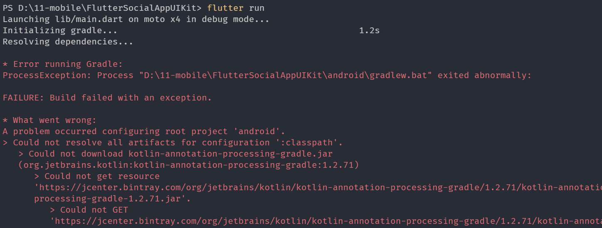

# flutter run时报错




这是报错截图，不要说，一定是网络的原因，不过，我已经挂了梯子了，还是不行，真是奇怪；


flutter run -v 

[参考了这里](https://www.jianshu.com/p/31e5800e18d9)

[还有这里](https://www.jianshu.com/p/31e5800e18d9)

[这里可能是答案](https://www.cnblogs.com/JobbyM/p/9995485.html)


修改了 D:\zappenv\flutter\packages\flutter_tools\gradle

```gradle
uildscript {
    repositories {
      //  google()
      //  jcenter()
	   maven{ url 'https://maven.aliyun.com/repository/google' }
       maven{ url 'https://maven.aliyun.com/repository/jcenter' }
	   maven{ url 'https://maven.aliyun.com/repository/gradle-plugin'}
    }
    dependencies {
        classpath 'com.android.tools.build:gradle:3.2.1'
    }
}
```


设置了使用阿里云的仓库，没用挂梯子，问题就解决了！