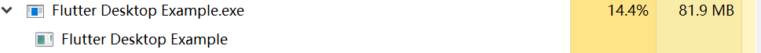

# 在 windows 桌面使用 flutter

[Google 的 flutterx 项目桌面端 github](https://github.com/google/flutter-desktop-embedding)

按这个过程编译即可：
Run a Flutter project in Desktop

- Step 1: For Flutter to run on Desktop, we must be on the master channel, with the latest release. So run from cmd,

flutter channel master
and

flutter upgrade

- Step 2: Then we have to enable flutter desktop support.

set ENABLE_FLUTTER_DESKTOP=true

- Step 3: Then clone this repo and cd example directory.

- Step 4: Then replace the lib folder inside the example directory with our existing code, and replace the pubspec.yaml file, with our existing one.

- Step 5: Then run from terminal

flutter packages get
and

flutter run
You can find more info here.

不过，因为网络关系，可能需要手动做些事情，比如中间某些依赖库下不下来，我们可以在 flutter run -v 时观察到底卡在哪里了，手动下载然后放在相应的位置，本地路径一般是在 flutter 的安装路径下的 cache 目录：比如我的：`D:\zappenv\flutter\bin\cache\downloads`

折腾了很久，总算编译成功了：

但是，我不得不泼冷水的是 CPU 和内存占用惊人啊：

而且响应能力也是着急的，完全比不了原生的，这也是自然而然的；

不过，目前整个项目还只能使用 debug，没有 release，所以，可能还需要等等；

但是，无论如何，成功了不是么。

运行时是把 dart 代码转换成 cpp 的 windows 原生代码，这个逻辑是正确的，可以保证效率，

对比 run 前后的代码目录，发现多了一个 flutter 命名的目录，里面是各种 cpp 封装代码。

顺手关注了[这个网站](https://feather-apps.com/)，目前还只是在 apla 测试，只支持 mac,等到支持 windows 了再回来看看

总之，看到了 flutter 的潜力，但是目前还无法替代原生的 windows 开发啊，我还是回去折腾网易的 duilib 吧；
