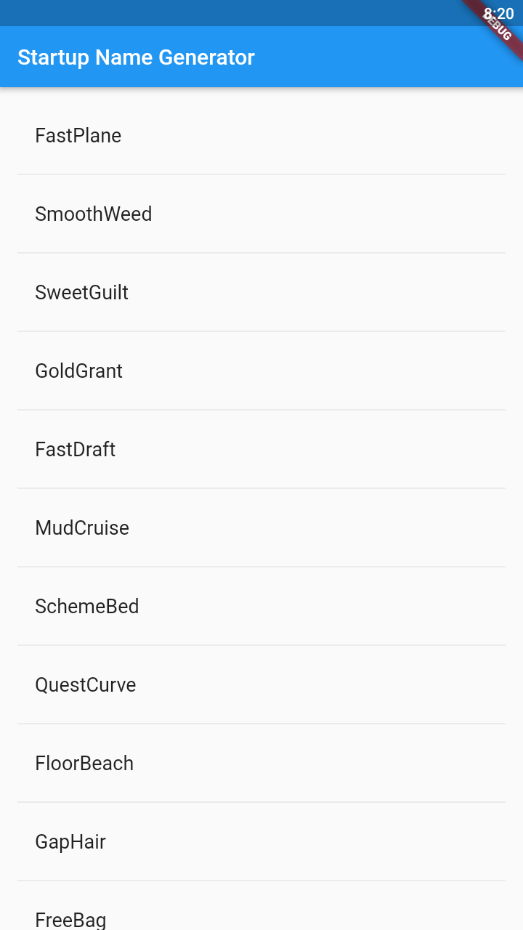

# 这是官方的第四步

## 创建一个无限滚动的ListView

使得 `RamdomWordsStatue` 产生和显示一个单词list，当用户滚动时，list展示一个`ListView`widget。

code here
```dart
import 'package:english_words/english_words.dart' as prefix0;
import 'package:flutter/material.dart';

void main() => runApp(MyApp());

class MyApp extends StatelessWidget {
  // This widget is the root of your application.
  @override
  Widget build(BuildContext context) {
    // final WordPair = prefix0.WordPair.random();
    return MaterialApp(
      title: 'Startup Name Generator',
      home: RandomWords(),
    );
  }
}

class RandomWordsState extends State<RandomWords> {
  final _suggestions = <prefix0.WordPair>[];
  final _biggerFont = const TextStyle(fontSize: 20.0);

  Widget _buildSuggestions() {
    return ListView.builder(
        padding: const EdgeInsets.all(16.0),
        itemBuilder: (context, i) {
          if (i.isOdd) return Divider();

          final index = i ~/ 2;
          if (index >= _suggestions.length) {
            _suggestions.addAll(prefix0.generateWordPairs().take(10));
          }
          return _buildRow(_suggestions[index]);
        });
  }

  Widget _buildRow(prefix0.WordPair pair) {
    return ListTile(
      title: Text(
        pair.asPascalCase,
        style: _biggerFont,
      ),
    );
  }

  @override
  Widget build(BuildContext context) {
    return Scaffold(
      appBar: AppBar(
        title: Text('Startup Name Generator'),
      ),
      body: _buildSuggestions(),
    );
  }
}

class RandomWords extends StatefulWidget {
  @override
  RandomWordsState createState() => RandomWordsState();
}

```

