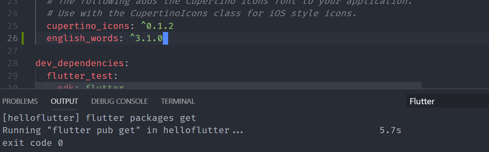

# 使用一个额外的包

[flutter 的包管理](https://pub.dev/flutter)

参考 Flutter 的官方网站https://flutter.dev/docs/get-started/codelab
添加一个 名为 english_words 的包，

1. 在文件`pubspec.yaml`中，添加`english_words`包，3.1.0 或更高的版本，

```dart
dependencies:
  flutter:
    sdk: flutter

  # The following adds the Cupertino Icons font to your application.
  # Use with the CupertinoIcons class for iOS style icons.
  cupertino_icons: ^0.1.2
  english_words: ^3.1.0
```

添加完成后，将自动下载这个包：


2. 或使用 命令 `flutter pub get`下载之；
3. 在 lib\main.dart 添加这个包
   `import 'package:english_words/english_words.dart' as prefix0;`
   这个包会自动被 vscode 添加，当我使用 wordpair 时，不得不说，插件写的极好；
4. final WordPair = prefix0.WordPair.random()
5. WordPair.asPascalCas

