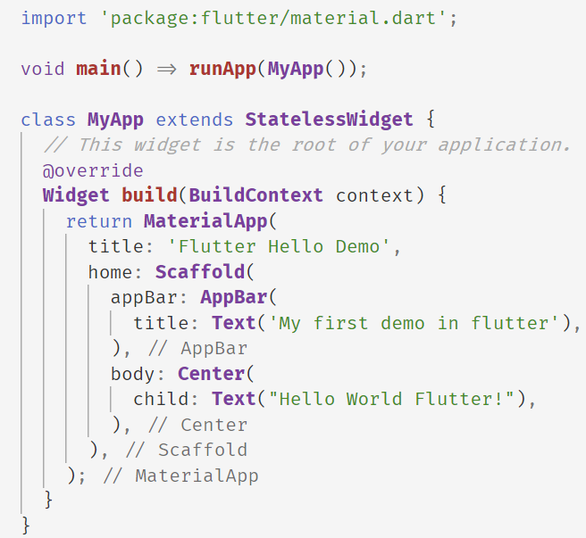
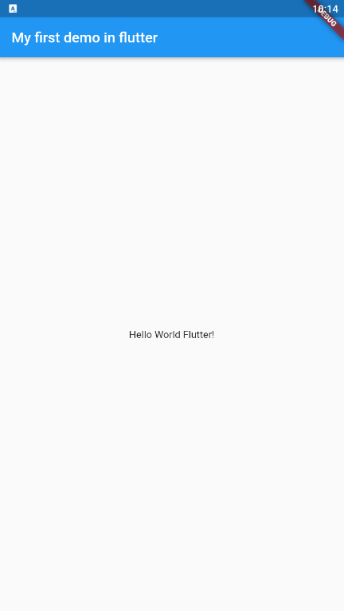

# hello world ,flutter

代码如下：

```dart
import 'package:flutter/material.dart';

void main() => runApp(MyApp());

class MyApp extends StatelessWidget {
  // This widget is the root of your application.
  @override
  Widget build(BuildContext context) {
    return MaterialApp(
      title: 'Flutter Hello Demo',
      home: Scaffold(
        appBar: AppBar(
          title: Text('My first demo in flutter'),
        ),
        body: Center(
          child: Text("Hello World Flutter!"),
        ),
      ),
    );
  }
}

```

Observations：

- This example creates a Material app. Material is a visual design language that is standard on mobile and the web. Flutter offers a rich set of Material widgets.
- The main() method uses arrow (=>) notation. Use arrow notation for one-line functions or methods.
- The app extends StatelessWidget which makes the app itself a widget. In Flutter, almost everything is a widget, including alignment, padding, and layout.
- The Scaffold widget, from the Material library, provides a default app bar, title, and a body property that holds the widget tree for the home screen. The widget subtree can be quite complex.
- A widget’s main job is to provide a build() method that describes how to display the widget in terms of other, lower level widgets.
- The body for this example consists of a Center widget containing a Text child widget. The Center widget aligns its widget subtree to the center of the screen.


不得不承认，括号实在有点多了，特别是下括号，但是借助 vscode 的代码提示和下括号自动注释，我觉得轻松了不少；
vscode 下的提示是这样的：



我也能写安卓程序了哈；



## 小结

这是 2019 年 7 月 10 日最大的收获，本来不准备做这方面的尝试了的，不过最终还是没有顶住移动端的诱惑入坑了，目前感觉良好，后面会学习 github 上的[flutter example](https://github.com/flutter/samples/blob/master/INDEX.md)来继续深入的学习。
