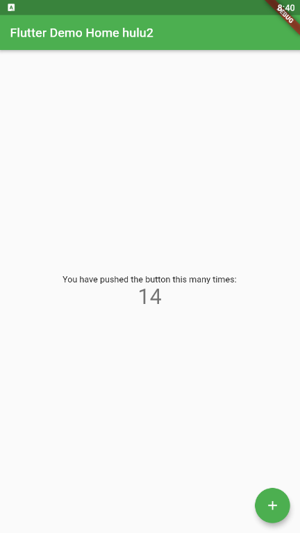
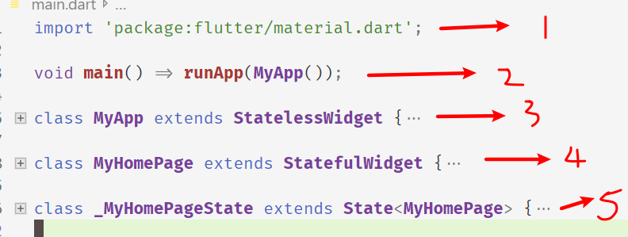

# flutter 第一个 demo 分析

使用 vscode 能自动生成一个计数器 demo，分析这个 demo 来入门吧：

## 试玩

运行后显示如图，


在 lib\main.dart 文件中做些修改：
这里我已经修改了首页的 title

```dart
home: MyHomePage(title: 'Flutter Demo Home hulu2'),
```

修改了主题的颜色。默认是颜色

```dart
theme: ThemeData(
        primarySwatch: Colors.green,
      ),
```

## 分析源码

把源码分为 5 部分：



### 第一部分

```dart
import 'package:flutter/material.dart';
```

导入包，这个包是 material.dart 包，用于 android 的 material 设计；

### 第二部分

```dart
void main() => runApp(MyApp());
```

入口函数 main，用于启动 runApp，runApp 的参数是我们自己定义的 class，MyApp；
这个 runApp 函数肯定有一个事件循环，用于事件监听和处理的；

### 第三部分

```dart
class MyApp extends StatelessWidget {
  // This widget is the root of your application.
  @override
  Widget build(BuildContext context) {
    return MaterialApp(
      title: 'Flutter Demo',
      theme: ThemeData(
        primarySwatch: Colors.green,
      ),
      home: MyHomePage(title: 'Flutter Demo Home hulu2'),
    );
  }
}
```

去除了注释，仅分析代码本身：类 MyApp 继承于 StatelessWidget，覆写其 build 方法。可知，整个 app 由一个 widget 构成，build 后返回一个 MaterialApp，这里设置了 widget 的 title，theme 和 home；home 本身也是一个 widget。在第四部分了；

### 第四部分

```dart
class MyHomePage extends StatefulWidget {
  MyHomePage({Key key, this.title}) : super(key: key);
  final String title;
  @override
  _MyHomePageState createState() => _MyHomePageState();
}
```

类 MyHomePage 继承于一个带状态的 widget ，其状态产生 由 \_MyHomePageState 函数生成。
我们可以简单认为 Stateful widget 和 Stateless widget 有两点不同：

1. Stateful widget 可以拥有状态，这些状态在 widget 生命周期中是可以变的，而 Stateless widget 是不可变的。
2. Stateful widget 至少由两个类组成：

- 一个 StatefulWidget 类。
- 一个 State 类； StatefulWidget 类本身是不变的，但是 State 类中持有的状态在 widget 生命周期中可能会发生变化。
- \_MyHomePageState 类是 MyHomePage 类对应的状态类。看到这里，细心的读者可能已经发现，和 MyApp 类不同， MyHomePage 类中并没有 build 方法，取而代之的是，build 方法被挪到了\_MyHomePageState 方法中，至于为什么这么做，先留个疑问，在分析完完整代码后再来解答。

### 第五部分

```dart
class _MyHomePageState extends State<MyHomePage> {
  int _counter = 0;

  void _incrementCounter() {
    setState(() {
      _counter++;
    });
  }

  @override
  Widget build(BuildContext context) {
    return Scaffold(
      appBar: AppBar(
        title: Text(widget.title),
      ),
      body: Center(
        child: Column(

          mainAxisAlignment: MainAxisAlignment.center,
          children: <Widget>[
            Text(
              'You have pushed the button this many times:',
            ),
            Text(
              '$_counter',
              style: Theme.of(context).textTheme.display1,
            ),
          ],
        ),
      ),
      floatingActionButton: FloatingActionButton(
        onPressed: _incrementCounter,
        tooltip: 'Increment',
        child: Icon(Icons.add),
      ),
    );
  }
}

```

\_MyHomePageState 是一个 widget，则需要 build，

`Scaffold` 是 Material 库中提供的页面脚手架，是一个 class；其定义了 3 个组件，包含导航栏和 Body 以及 FloatingActionButton（如果需要的话）。

- appBar 定义了 title: **Text**(widget.title),

- body 使用了**Center**布局
  // Center is a layout widget. It takes a single child and positions it
  // in the middle of the parent.

  - 其 child: **Column**定义为 Column 布局；

    _// Column is also layout widget. It takes a list of children and_

​ _// arranges them vertically. By default, it sizes itself to fit its_

​ _// children horizontally, and tries to be as tall as its parent._

​ 在 Column 下有布局了两个 widget，一个是 text：You have pushed the button this many times:',

另一个是显示 '\$\_counter',

- floatingActionButton 这是一个浮动按钮，onPressed 时的响应函数是 **\_incrementCounter** 。

`Scaffold` 还有其他组件，可以 F12 查看之。

**现在，我们将整个流程串起来：当右下角的 floatingActionButton 按钮被点击之后，会调用`_incrementCounter`，在`_incrementCounter`中，首先会自增`_counter`计数器（状态），然后`setState`会通知 Flutter 框架状态发生变化，接着，Flutter 会调用`build`方法以新的状态重新构建 UI，最终显示在设备屏幕上。**

### 为什么要将 build 方法放在 State 中，而不是放在 StatefulWidget 中？

现在，我们回答之前提出的问题，为什么`build()`方法在 State（而不是 StatefulWidget）中 ？这主要是为了开发的灵活性。如果将`build()`方法在 StatefulWidget 中则会有两个问题：

- 状态访问不便

  试想一下，如果我们的 Stateful widget 有很多状态，而每次状态改变都要调用`build`方法，由于状态是保存在 State 中的，如果将`build`方法放在 StatefulWidget 中，那么构建时读取状态将会很不方便，试想一下，如果真的将`build`方法放在 StatefulWidget 中的话，由于构建用户界面过程需要依赖 State，所以`build`方法将必须加一个`State`参数，大概是下面这样：

  ```dart
    Widget build(BuildContext context, State state){
        //state.counter
        ...
    }
  ```

  这样的话就只能将 State 的所有状态声明为公开的状态，这样才能在 State 类外部访问状态，但将状态设置为公开后，状态将不再具有私密性，这样依赖，对状态的修改将会变的不可控。将`build()`方法放在 State 中的话，构建过程则可以直接访问状态，这样会很方便。

- 继承 StatefulWidget 不便

  例如，Flutter 中有一个动画 widget 的基类`AnimatedWidget`，它继承自`StatefulWidget`类。`AnimatedWidget`中引入了一个抽象方法`build(BuildContext context)`，继承自`AnimatedWidget`的动画 widget 都要实现这个`build`方法。现在设想一下，如果`StatefulWidget` 类中已经有了一个`build`方法，正如上面所述，此时`build`方法需要接收一个 state 对象，这就意味着`AnimatedWidget`必须将自己的 State 对象(记为\_animatedWidgetState)提供给其子类，因为子类需要在其`build`方法中调用父类的`build`方法，代码可能如下：

  ```dart
  class MyAnimationWidget extends AnimatedWidget{
      @override
      Widget build(BuildContext context, State state){
        //由于子类要用到AnimatedWidget的状态对象_animatedWidgetState，
        //所以AnimatedWidget必须通过某种方式将其状态对象_animatedWidgetState
        //暴露给其子类
        super.build(context, _animatedWidgetState)
      }
  }
  ```

  这样很显然是不合理的，因为

  1. `AnimatedWidget`的状态对象是`AnimatedWidget`内部实现细节，不应该暴露给外部。
  2. 如果要将父类状态暴露给子类，那么必须得有一种传递机制，而做这一套传递机制是无意义的，因为父子类之间状态的传递和子类本身逻辑是无关的。

综上所述，可以发现，对于 StatefulWidget，将`build`方法放在 State 中，可以给开发带来很大的灵活性
