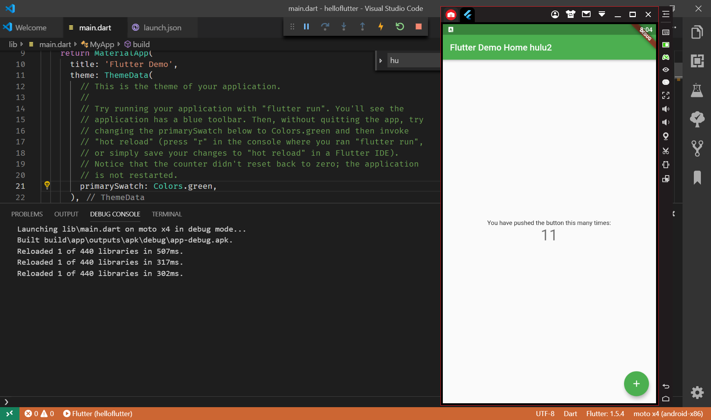

# 获取 Flutter SDK

去 flutter 官网下载其最新可用的安装包，官网地址：https://flutter.io/sdk-archive/#windows

注意，Flutter 的渠道版本会不停变动，请以 Flutter 官网为准。另外，在中国大陆地区，要想正常获取安装包列表或下载安装包，可能需要翻墙，读者也可以去 Flutter github 项目下去下载安装包，地址：https://github.com/flutter/flutter/releases 。

将安装包 zip 解压到你想安装 Flutter SDK 的路径（如：C:\src\flutter；注意，不要将 flutter 安装到需要一些高权限的路径如 C:\Program Files\）。

在 Flutter 安装目录的 flutter 文件下找到 flutter_console.bat，双击运行并启动 flutter 命令行，接下来，你就可以在 Flutter 命令行运行 flutter 命令了。

更新环境变量
如果你想在 Windows 系统自带命令行（而不是）运行 flutter 命令，需要添加以下环境变量到用户 PATH：

转到 “控制面板>用户帐户>用户帐户>更改我的环境变量”
在“用户变量”下检查是否有名为“Path”的条目:
如果该条目存在， 追加 flutter\bin 的全路径，使用 ; 作为分隔符.
如果该条目不存在，创建一个新用户变量 Path ，然后将 flutter\bin 的全路径作为它的值.
重启 Windows 以应用此更改.

运行 flutter doctor 命令
在 Flutter 命令行运行如下命令来查看是否还需要安装其它依赖，如果需要，安装它们：

flutter doctor
该命令检查你的环境并在命令行窗口中显示报告。Dart SDK 已经在打包在 Flutter SDK 里了，没有必要单独安装 Dart。 仔细检查命令行输出以获取可能需要安装的其他软件或进一步需要执行的任务。

例如：

[-] Android toolchain - develop for Android devices
• Android SDK at D:\Android\sdk
✗ Android SDK is missing command line tools; download from https://goo.gl/XxQghQ
• Try re-installing or updating your Android SDK,
visit https://flutter.io/setup/#android-setup for detailed instructions.
第一次运行 flutter 命令（如 flutter doctor）时，它会下载它自己的依赖项并自行编译。以后再运行就会快得多。缺失的依赖需要安装一下，安装完成后再运行 flutter doctor 命令来验证是否安装成功。

Android 设置
Flutter 依赖于 Android Studio 的全量安装。Android Studio 不仅可以管理 Android 平台依赖、SDK 版本等，而且它也是 Flutter 开发推荐的 IDE 之一（当然，你也可以使用其它编辑器或 IDE，我们将会在后面讨论）。

安装 Android Studio
下载并安装 Android Studio，下载地址：https://developer.android.com/studio/index.html 。
启动 Android Studio，然后执行“Android Studio 安装向导”。这将安装最新的 Android SDK、Android SDK 平台工具和 Android SDK 构建工具，这些是用 Flutter 进行 Android 开发所需要的。

## 安卓模拟器，

机缘巧合安装了微软的模拟器居然可以在我的 amd r7 处理器的 TP 上使用，而且适应了下，速度还是不错的；

try g vscode use vs emulator

## 使用`flutter doctor` 处理升级和 dart sdk 问题

## 创建 Flutter 应用

启动 VS Code
调用 View>Command Palette…
输入 ‘flutter’, 然后选择 ‘Flutter: New Project’ action
输入 Project 名称 (如 myapp), 然后按回车键
指定放置项目的位置，然后按蓝色的确定按钮
等待项目创建继续，并显示 main.dart 文件

android sdk path :C:\Users\Administrator\AppData\Local\Android\Sdk

## 使用蓝叠模拟器
试用了无数个模拟器，总算找到一个能用的了，就是蓝叠模拟器；
使用前在cmd中输入`adb connect 127.0.0.1:5555` 然后就可以在vscode中调试了；
如果没有自动启动app，需要手动启动下程序；

