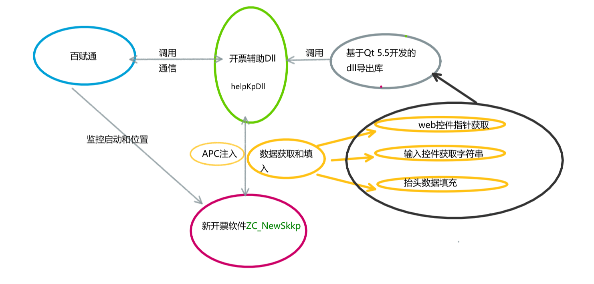

# 书解《图形思考与表达的20堂课》

## 基础篇

### 图解入门

- 条目式写法的不足 
  - 缺少关联 
  - 结构性不足
- 图解
  - 利于表达，
    - 更有说服力 “表达技巧”
    - 更具空间感的表达方式
      - 关系
      - 权重
  - 帮助思考
    - 整理思维
  - 解决工作和生活中的实际问题
    - 促进沟通
- 动手做图，而不要祈求完美
  - 答案不止一个
- 讨论可以让图解更好

### 基础表达

#### 准备阶段

- 先通读文章，标记之
- 把标记的位置再读一遍，把关键词圈出

#### 图解阶段

- 把关键词 特性分类
- 6种圆圈表关系、位置、结构
  - 包含
  - 邻接
  - 重叠
  - 分类
  - 并列
  - 群立
- 7种箭头表 移动、顺序、方向、关系
  - 连续
  - 展开
  - 顺序
  - 对立
  - 互动
  - 扩散
  - 因果

### 原则

#### 鸟瞰 ，整体架构

- 信息分组后 加关键词（抽象化，更高维度）
- 核心主题凸显（放中间）
- 注意细节
  - 仍要关注内在联系
  - 语言简练

### 要素

#### 标题

- 随深入而变化
- 抽象出本质
- 富有冲击力

#### 结论

- 30字左右为宜

### 秘技

- 站在读者的观点上
  - 表达方式要随着传达的对象而异
- 善用圆圈和箭头的形状和颜色
- 标示顺序
- 数字和图表赋予图解生命
  - 数字增加说服力
  - 图表展示 比较，变化 趋势等
  - 慎用插图

## 实践篇

### 图解前须知

- 用图解进行讨论
  - 创造知识的乐趣
- 利于沟通
- 拥有自己的主张
  - 加入自己的想法
  - 独立思考

### 运用于生活和工作

- 图解与结论要一致
- 仔细推敲二者的关系
- 抽出书中关键字
- 插图容易导致概念混淆
- 克服“好像还没有完成”的不安
- 继续 图解思考，激发意想不到的观点

### 图解即素材翻译

- 使用自己的语言

