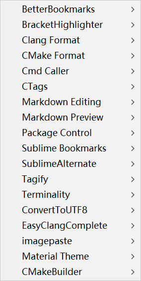
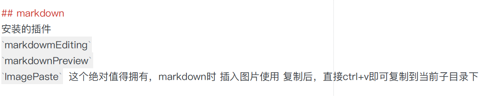

# 重新启用sublime

## 配置
当前的 sublime 配置：

```json
{
  {
    "always_show_minimap_viewport": true,
    "auto_complete_commit_on_tab": false,
    "auto_complete_with_fields": true,
    "block_caret": true,
    "bold_folder_labels": true,
    "caret_extra_bottom": 1,
    "caret_extra_top": 1,
    "caret_extra_width": 4,
    "caret_style": "solid",
    "color_scheme": "Packages/chester-atom/Chester-Atom.tmTheme",
    "dpi_scale": 1.0,
    "file_exclude_patterns":
    [
        "*.ilk",
        "*.iobj",
        "*.tags",
        "*.tags_sorted_by_file",
        "*.ipch",
        "*.pch",
        "*.pyc",
        "*.pyo",
        "*.exe",
        "*.dll",
        "*.obj",
        "*.o",
        "*.a",
        "*.lib",
        "*.so",
        "*.dylib",
        "*.ncb",
        "*.sdf",
        "*.suo",
        "*.pdb",
        "*.idb",
        ".DS_Store",
        "*.class",
        "*.psd",
        "*.db",
        "*.sublime-workspace"
    ],
    "folder_exclude_patterns":
    [
        ".svn",
        ".git",
        ".hg",
        "CVS"
    ],
    "font_face": "萍方-简",
    "font_options":
    [
        "directwrite"
    ],
    "font_size": 11,
    "ignored_packages":
    [
        "Markdown",
        "Vintage"
    ],
    "indent_guide_options":
    [
        "draw_normal",
        "draw_active"
    ],
    "line_padding_bottom": 2,
    "line_padding_top": 1,
    "rulers":
    [
        100
    ],
    "theme": "Default.sublime-theme",
    "word_wrap": "true"
}

}
```

## 智能提示
`EasyClangComplete` 自定义的配置文件：

```json
{
    "common_flags" : [
    // some example includes
    "-I/usr/include",
    "-I$project_base_path",
    // this is needed to include the correct headers for clang
    "-ID:\\zappenv\\LLVM\\lib\\clang\\8.0.0\\include",
    ],
    "clang_binary" : "D:\\zappenv\\LLVM\\bin\\clang++",
    "hide_default_completions": false,
     "show_type_info": false,
     "show_type_body" : false,
}   
```

## markdown 
安装的**插件**

### 插件一览表：


`markdowmEditing`

`markdownPreview`

`Image​Paste`  这个绝对值得拥有，markdown时 插入图片使用 复制后，直接ctrl+v即可复制到当前子目录下


## 终端调用
插件 `callcmd` 按键配置

> D:\Program Files\Sublime Text 3\Data\Packages\User\Default (Windows).sublime-keymap
> 

## 自定义的按键
```json
[
    { "keys": ["ctrl+e"], "command": "show_overlay", "args": {"overlay": "goto", "show_files": true} },
    { "keys": ["ctrl+b"], "command": "toggle_side_bar" },
    {"keys": ["ctrl+`"],
    "command": "cmd_caller_default"},
    {
    "keys": ["ctrl+shift+l"],
    "command": "cmd_caller_list"
  },
]
```
## bookmark 插件

`sublime bookmark`
需要使用配置，`Show Bookmarks In Current Project` 不然在查找bookmark时会找到全部的bookmark，这个很蛋疼的；
https://github.com/bollu/sublimeBookmark
There are three modes to the plugin:
1) All bookmarks will be shown all the time - bookmarks will not be filtered based on the current project. For this mode, use the __Show All Bookmarks__ option.

2)Only bookmarks of the current project will be shown - bookmarks belonging to other projects are *NOT* shown in this mode. Use the Use the __Show Bookmarks In Current Project__ for this mode.

3) Only bookmarks in the current file is shown - irrespective of project. Use the __Show Bookmarks In Current File__ option for this mode.

## 配置sumlime在wsl下的编译文件

### 普通标准配置
> D:\Program Files\Sublime Text 3\Data\Packages\User
> 

```json
{
    "cmd" : ["bash", "-c", "g++ ${file_name} -o ${file_base_name} && ./${file_base_name}"],
    "shell": true,
    "working_dir": "${file_path}",
}
```

### 带google test动态库文件的配置

```json
{
    "cmd" : ["bash", "-c", "g++ ${file_name} -o ${file_base_name}  -lgtest_main -lgtest -lpthread && ./${file_base_name}"],
    "shell": true,
    "working_dir": "${file_path}",
}
```
所有测试都通过了；

