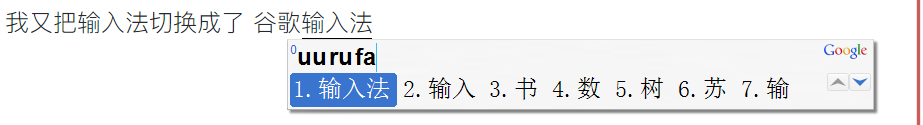

# 2019-07-12

昨天去了医院看了朋友，年纪轻轻就身体动刀了，躺在病床上的样子很是无助，是的，我们都是凡人，生老病死在所难免，我们能做的事情是让整个人生高质量的度过。我一直认为，拿自己的健康换钱的做法是不明智的。

今天继续学习Flutter。

我又把输入法切换成了 谷歌输入法，我真是喜欢新鲜



不过，没有变化的是，我一直在使用双拼输入。

尽管使用 了这么久，我的双拼一直没有达到我的预期，还需要继续练习，其实，归根结底，是我没有完全学会使用盲打。

这一点，我一直没有找到合适的练习盲打的方法。

OK，现在是09:33，我需要干活了。

我觉得自己把输入法的还是默认皮肤和字体最舒服。

现在我把设置项隐藏了，

默认是开启的中文，不设置中英文的切换按钮，因为每次都可能和我的编程时的打字习惯冲突，现在只有在使用

`Ctrl + 空格`时 退出输入法，默认就直接使用英文了，再次使用时继续按这个组合键，调出Google输入法，继续输入中文。

现在唯一的不便时，我不知道当前的输入法状态了，不是很直观

我只能说，在UI上，还是Google输入法更符合我的审美。

but ,one thing to pick it ,I cannot know the state about input method,what a pity.

---


## 工作时间

从10:03 开始吧

现在我需要知道 `SendInput` 方法 在使用 mouse时的鼠标位置 设置方式；

根据https://docs.microsoft.com/en-us/windows/win32/api/winuser/nf-winuser-sendinput中的描述

我设置了输入类型 type为**INPUT_MOUSE**

然后开始使用 `MOUSEINPUT` 结构体，

鼠标的`dx`

鼠标的`dy` 

> ```
> dx
> ```
>
> Type: **LONG**
>
> The absolute position of the mouse, or the amount of motion since the last mouse event was generated, depending on the value of the `dwFlags` member. Absolute data is specified as the x coordinate of the mouse; relative data is specified as the number of pixels moved.
>
> 翻译：鼠标的绝对位置，或者是
>
> 绝对数据被指定为鼠标的x坐标
>
> ```
> dy
> ```
>
> Type: **LONG**
>
> The absolute position of the mouse, or the amount of motion since the last mouse event was generated, depending on the value of the **dwFlags** member. Absolute data is specified as the y coordinate of the mouse; relative data is specified as the number of pixels moved.
>
> 绝对数据被指定为鼠标的y坐标


鼠标的dwFlags：

> ```
> dwFlags
> ```
>
> Type: **DWORD**
>
> A set of bit flags that specify various aspects of mouse motion and button clicks. The bits in this member can be any reasonable combination of the following values.

| **MOUSEEVENTF_ABSOLUTE **0x8000 | The **dx** and **dy** members contain normalized absolute coordinates. If the flag is not set, **dx **and **dy** contain relative data (the change in position since the last reported position). This flag can be set, or not set, regardless of what kind of mouse or other pointing device, if any, is connected to the system. For further information about relative mouse motion, see the following Remarks section. |
| ------------------------------- | ------------------------------------------------------------ |
|                                 |                                                              |

>  dx和dy成员包含标准化的绝对坐标。如果未设置标志，则dx和dy包含相对数据（自上次报告的位置以来的位置变化）


> ## Remarks
>
> If the mouse has moved, indicated by **MOUSEEVENTF_MOVE**, **dx**and **dy** specify information about that movement. The information is specified as absolute or relative integer values.
>
> If **MOUSEEVENTF_ABSOLUTE** value is specified, **dx** and **dy** contain normalized absolute coordinates between 0 and 65,535. The event procedure maps these coordinates onto the display surface. Coordinate (0,0) maps onto the upper-left corner of the display surface; coordinate (65535,65535) maps onto the lower-right corner. In a multimonitor system, the coordinates map to the primary monitor.
>
> 如果鼠标已移动（由**MOUSEEVENTF_MOVE**指示），则**dx**和**dy**指定有关该移动的信息。该信息被指定为绝对或相对整数值。
>
> 如果指定了**MOUSEEVENTF_ABSOLUTE**值，则**dx**和**dy**包含0到65,535之间的标准化绝对坐标。事件过程将这些坐标映射到显示表面上。坐标（0,0）映射到显示表面的左上角; 坐标（65535,65535）映射到右下角。在多监视器系统中，坐标映射到主监视器。


当前进度，在dpi为1时，正确填充了kp软件的待开数据；

如果思路是对的，但是程序没有按预期工作时，可以多检查下自己的代码，问题可能就是一个笔误。


