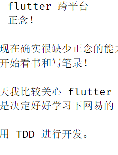

# 2019-07-19

一转眼 19 号了，自己现在有点打乱仗的感觉，一会搞搞 C++，一会玩玩 flutter，总之就是兴趣使然，任意而为，不过，到现在，我还是个蒙圈的样子，很多东西了解的不够深入，，但是时间也是用了一大把，这实在不是一个好的学习方法。

所以，我现在需要做的就是列一个学习计划，以及优先级；

1. C++
1. flutter 跨平台
1. 正念！

我现在确实很缺少正念的能力，思维总是无法沉浸，这真是个不好的习惯，《正念的奇迹》买来很久了，一直没有看，今晚，我就开始看书和写笔录！

今天我比较关心 flutter 的 desktop 方案，不过依赖一直在下载，挂梯子也无济于事，所以在 windows 桌面端这块，我还是决定好好学习下网易的 UI 库；

使用 TDD 进行开发。

在用 md 写文档时，最好少用图片，

