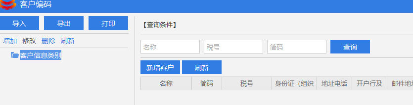
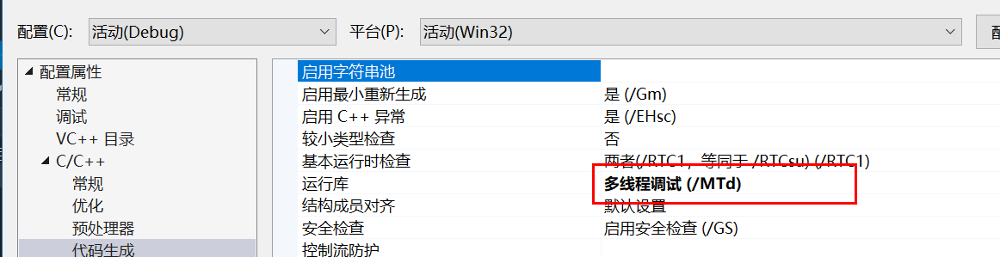
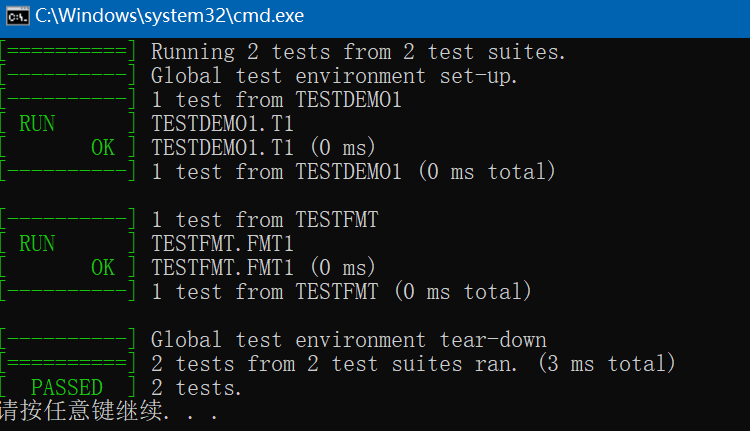

# 2019-07-24

05:06 :alarm_clock: 起床了

0​5::35 :runner:

06:46：处理NUI（网易的duilib衍生版本库）的高dpi图片资源的添加

NUI的doc路径 ： E:\05-gitbook\UIDocs ，使用gitbook 阅读很舒服；

07:08：阅读NUI的文档。

08:48 ：早餐 & 班车，到公司 :bus:

10:22：待开按钮的禁用逻辑 :black_nib:

12:05：处理2.9.0bug，修改打包脚本，

12:57：午餐  :sleeping_bed:,午休

13:48：百赋通2.8.4 版本提测 :artificial_satellite:

16:58 ： 处理待开按钮禁用时的性能问题  get，我可以调用ZC 的任何js代码，这个厉害了；


Definition and Usage. The <**tr**> tag defines a row in an HTML table. A <**tr**> element contains one or more <th> or <td> elements.

```
.main-khbm\
```

===>


原zc点击按钮后，最终调用的函数

getTargetIds:function(){

21:21：家庭时光


原因在于 

使用了mtd 编译，而gtest需要使用mdd 编译项目：


**故 ，把编译选项全部替换为MDD即可！！**

22:25： gtest的使用，1；需要把编译选项设置为MDD的类型，不然heap报错，2. 需要添加main函数

如下这里是测试的fmt库的 date格式输出： 测试OK

```c++
#include "gtest\gtest.h"
#include "fmt\time.h"
#include <time.h>
#include <string>

TEST(TESTDEMO1, T1) { EXPECT_EQ(1, 1); }

TEST(TESTFMT,FMT1){
	std::time_t t = std::time(nullptr);
	struct tm newtime;
	localtime_s(&newtime,&t);
	std::string g = fmt::format("The date is {:%Y-%m-%d}.", newtime);
	EXPECT_EQ(g,"The date is 2019-07-24.");
}

int main(int argc, char **argv) {
	::testing::InitGoogleTest(&argc, argv);
	return RUN_ALL_TESTS();
}
```



