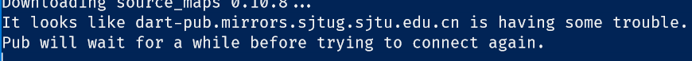

# 2019-07-26

05:43：散步40分钟

06:53：阅读极客 [架构课](https://time.geekbang.org/column/article/109592)，阅读[源码](https://github.com/qiniu/qpaint),不是很懂，于是开始看js的入门，后来又想起来[dart](https://dart.dev/tutorials/web/low-level-html/connect-dart-html)

:sweat_smile:我要说明的是，我没有神游！ :black_heart:

08:40 : :bread: and :bus:

10:05：处理XP兼容问题原来是Qt 5.5 的mingw环境下，xp里缺少支持_vsnprintf_s的动态运行库，不要使用这个函数即可

10:45：上传兼容性代码，处理联想窗回调使用体验问题

10:52: 测试oninput回调 ，觉得很卡顿；

11:12  换回使用微软自带的输入法，可惜不能直接获取时间了；:black_nib:为了一个输入法，我是操了多少心~

时间还是不能打，我还是使用【】的人呢。

现在 ，我是直接在中文输入时使用的因为标点，但是我的常用的标点还是要使用中文的，比如逗号 句号等，于是，我设置了自定义的短语:

比如  【】 :


这样，在我写markdown 文档时，就不必要中英文之间不停的切换了，毕竟，我经常需要使用英文符号。


唯一的遗憾时，我无法顺利的打出当前时间以便记录我的工作日志了。


11时49分 : 顺利切换到 微软的输入法。


:kissing_smiling_eyes:

😁

`输入颜文字的方式 字母 -->tab --> 空格键 ;`

😡

OK!

词库就只能慢慢养了

名字放在最前面了


中英文的默认切换方式是  ctrl + 空格，设置为shift 或者ctrl 都影响我的编码;

13时44分 : 处理用户输入的字符串接收buf不够大的问题，这里的原因是Qt在unix的编译器下 :

`int QString::toWCharArray(wchar_t * array) const
Fills the array with the data contained in this QString object. The array is encoded in UTF-16 on platforms where wchar_t is 2 bytes wide (e.g. windows) and in UCS-4 on platforms where wchar_t is 4 bytes wide (most Unix systems).`

`toWCharArray `会按4个字节 处理宽字节;


14时11分:又折腾了下编辑器的主题,安装了字体Operator Mono，不过在vscode下居然没效?!


15时27分 :配置dart的web编程 配置 工具 : C:\Users\Administrator\AppData\Roaming\Pub\Cache\bin

```
pub global activate webdev  //web开发工具
pub global activate stagehand  //项目配置工具
```

国内镜像:

你需要为此设置两个环境变量：“PUB_HOSTED_URL”和“FLUTTER_STORAGE_BASE_URL”

### Flutter 社区

FLUTTER_STORAGE_BASE_URL: https://storage.flutter-io.cn
PUB_HOSTED_URL: https://pub.flutter-io.cn

### 上海交通大学 Linux 用户组

FLUTTER_STORAGE_BASE_URL: https://mirrors.sjtug.sjtu.edu.cn
PUB_HOSTED_URL: https://dart-pub.mirrors.sjtug.sjtu.edu.cn



确实是在 国内镜像网站上下载,但是还是很慢...

直接翻墙 还是不够快啊,用vscode下载的极慢

16:20 跑去看dart的相关网页了;处理了下打印待开按钮的响应事件


C:\Users\Administrator\AppData\Roaming\Pub\Cache\hosted  dart依赖的下载路径

22时02分 :处理完毕bug,现在在看fmt 和 log打印源码[spdlog](https://github.com/gabime/spdlog)

二者合并 ,应该很不错,已通过vcpkg 下载了 spdlog;明天继续  

22时45分:现在 总算把dart的web编程的依赖下载完毕了;可以接下来了?


