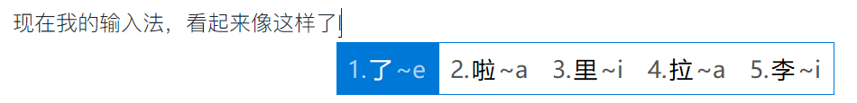

# 使用 RIME 输入法

小狼毫 RIME

現在開始使用 小鶴雙拼了啊

爲何是 繁體呢？

現在總算是在使用小鶴雙拼了，只是 還需要把 它變成 簡體字才行。

修改 小鹤双拼的 配置文件 如下：

```cpp
switches:
  - name: ascii_mode
    reset: 0
    states: [ 中文, 西文 ]
  - name: full_shape
    states: [ 半角, 全角 ]
  - name: simplification
    reset: 1
    states: [ 漢字, 汉字 ]
  - name: ascii_punct
    states: [ 。，, ．， ]
```

事实上 ，改变的只有 name: simplification 下一行的 reset 的 1 而已；

現在 now i will use this input method ，中文变化了，简体出来了，哈哈！


进一步配置下[RIME](https://www.jianshu.com/p/296bba666604)

按这个链接的方式，配置了rime，感觉再好不过了，不过，词库估计还得手动培养。

还不是特别的智能，无法及时的联想出来

现在我的输入法，看起来像这样了



码字再也不说了。嘿嘿

