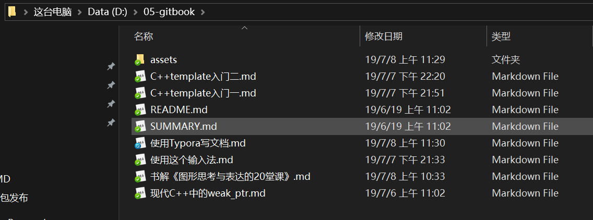
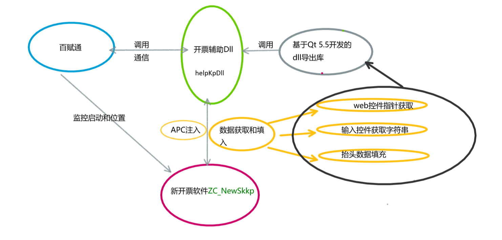

# 开启新的记录

## 一、论中文排版的重要性

### 论语 学而篇 第一

**作者：**孔子（ 前 551 年 9 月 28 日－前 479 年 4 月 11 日 ）

#### 本篇引语

《学而》是《论语》第一篇的篇名。《论语》中各篇一般都是以第一章的前二三个字作为该篇的篇名。《学而》一篇包括 16 章，内容涉及诸多方面。其中重点是「吾日三省吾身」；「节用而爱人，使民以时」；「礼之用，和为贵」以及仁、孝、信等道德范畴。

#### 原文

子曰：「学而时习之，不亦说乎？有朋自远方来，不亦乐乎？人不知，而不愠，不亦君子乎？」

#### 译文

孔子说：「学了又时常温习和练习，不是很愉快吗？有志同道合的人从远方来，不是很令人高兴的吗？人家不了解我，我也不怨恨、恼怒，不也是一个有德的君子吗？」

#### 评析

​ 宋代著名学者朱熹对此章评价极高，说它是「入道之门，积德之基」。本章这三句话是人们非常熟悉的。历来的解释都是：学了以后，又时常温习和练习，不也高兴吗等等。三句话，一句一个意思，前后句子也没有什么连贯性。但也有人认为这样解释不符合原义，指出这里的「学」不是指学习，而是指学说或主张；「时」不能解为时常，而是时代或社会的意思，「习」不是温习，而是使用，引申为采用。而且，这三句话不是孤立的，而是前后相互连贯的。这三句的意思是：自己的学说，要是被社会采用了，那就太高兴了；退一步说，要是没有被社会所采用，可是很多朋友赞同我的学说，纷纷到我这里来讨论问题，我也感到快乐；再退一步说，即使社会不采用，人们也不理解我，我也不怨恨，这样做，不也就是君子吗？（见《齐鲁学刊》1986 年第 6 期文）这种解释可以自圆其说，而且也有一定的道理，供读者在理解本章内容时参考。

​ 此外，在对「人不知，而不愠」一句的解释中，也有人认为，「人不知」的后面没有宾语，人家不知道什么呢？当时因为孔子有说话的特定环境，他不需要说出知道什么，别人就可以理解了，却给后人留下一个谜。有人说，这一句是接上一句说的，从远方来的朋友向我求教，我告诉他，他还不懂，我却不怨恨。这样，「人不知」就是「人家不知道我所讲述的」了。这样的解释似乎有些牵强。

​ 总之，本章提出以学习为乐事，做到人不知而不愠，反映出孔子学而不厌、诲人不倦、注重修养、严格要求自己的主张。这些思想主张在《论语》书中多处可见，有助于对第一章内容的深入了解。

## 二 码农不能得罪

### 使用 emoji 为文章添加趣味

:email:yousaid820@163.com

:kissing_smiling_eyes:哈哈,这里是一段好的开始

:cry:可惜,我发现的太晚.

OK,It is prefect!

### 使用代码编排

```c++
#include <iostream>
int main(int argc,const char* argv[])
{
    std::cout << "Not So good for it" << std::endl;
    return 0;
}
```

使用 misty 主题 非常 抢眼.

## 三 所有的文件全部云同步到坚果云中

书写的文件,包括截的图都将同步到我的坚果云中;


现在使用了 gitbook 目录:



## 四 使用 RIME 输入法

这款输入法 还是需要 多学习配置下的，目前使用起来和微软的输入法差不多，不过，随着，使用时间的增多，相信用户词库会不断完善的，打字起来会越来越舒服的。

我习惯使用 shift 键输入英文大写，看来这个习惯 要改改了。不然 ，和中英文的切换就重合了。

[使用这个输入法](使用RIME输入法.md)

## 五 使用 OneNote 图解笔记 RIME

这是示例图：



不过，Windows 10 版本的 OneNote 联网是个大问题，于是又换成了 OneNote2016 ，熟悉的感觉又回来了；
